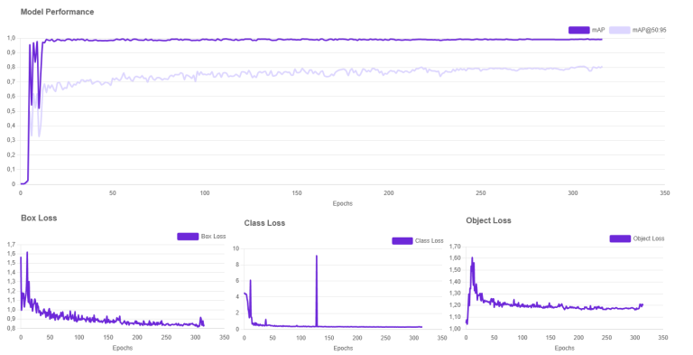
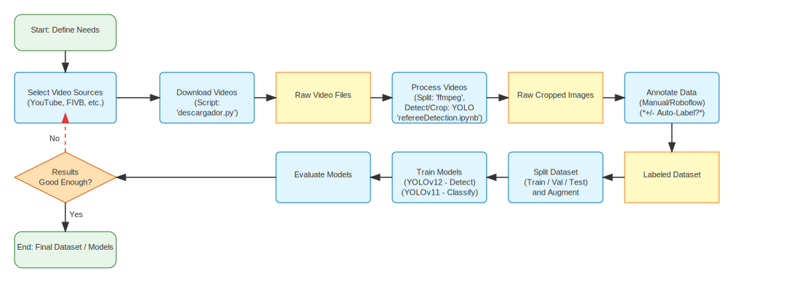

# Referee Detection System

A computer vision system designed to detect and track referees in sports videos using YOLO (You Only Look Once) object detection, with a focus on volleyball officiating and signal classification. The system includes advanced YouTube video processing capabilities for automated data collection and analysis.

## Acknowledgments

This project has been developed in collaboration with the Real Federación Española de Voleibol (RFEVB), who granted permission for the use of their official match videos for AI training purposes. This collaboration has been crucial for the development and validation of the system.

## Training Dataset

The model has been trained using a carefully curated dataset of referee signals from official volleyball matches. The dataset includes the following signal classes:

| Signal Class | Image Count |
|--------------|-------------|
| Point (Left Arm) | 381 |
| Point (Right Arm) | 282 |
| Service Fault (Left Serve) | 185 |
| Service Fault (Right Serve) | 161 |
| Net Touch | 164 |
| Ball Outside | 113 |
| Four Hits | 52 |
| Ball Touched | 48 |
| **Subtotal (Listed Classes)** | **1,386** |

**Note:** The training images are currently private and not publicly available due to copyright restrictions. Access to the dataset requires explicit permission from the RFEVB.

## Training Metrics



**Explanation:**

- **Model Performance (mAP):**
  The top plot shows the evolution of the main performance metric: mAP (mean Average Precision), both overall and at an IoU threshold of 0.5, over 350 epochs. The model quickly reaches a high mAP and maintains it throughout training, indicating strong and stable detection and classification performance for referee signals.

- **Box Loss, Class Loss, Object Loss:**
  The three lower plots show the evolution of the loss values during model training. All losses decrease rapidly in the early epochs and stabilize at low values, with occasional spikes. This indicates that the model is learning effectively and converging well, with only minor fluctuations.

These metrics reflect that the model is able to effectively learn to detect and classify referee signals, achieving high and stable performance across a long training period.

## System Architecture



## Overview

This system processes video files to detect and track referees, creating segmented video clips that focus on the referee's movements. The system uses a trained YOLO model optimized for referee detection and includes features for video segmentation and processing. It represents a significant advancement in automated sports analysis technology.

## Key Features

- Real-time referee detection using YOLO model
- Video segmentation into configurable time intervals
- Automatic video processing pipeline
- GPU acceleration support (CUDA)
- Frame tracking and persistence
- Automatic file management for processed videos
- Temporal consistency mechanisms for robust video analysis
- Dual-model architecture for detection and classification tasks
- **YouTube video processing and automated data collection**
- **Web-based annotation interface with three-screen architecture**
- **Automated cropping with configurable margins**

## Research Contributions

### Technical Contributions
- A dual-model architecture that effectively separates detection and classification tasks
- Novel implementation of temporal consistency mechanisms for robust video analysis
- Empirical evaluation of data augmentation strategies for sports-specific gesture recognition
- Insights into precision-recall trade-offs in signal classification models
- **Automated YouTube video processing pipeline for scalable data collection**

### Practical Applications
- Automated volleyball match analysis system
- Enhanced broadcast capabilities for all competition levels
- Foundation for automated graphics generation and statistics compilation
- Pathway toward comprehensive match analysis through unsupervised learning
- **Web-based annotation system for collaborative data labeling**

## Impact

### Sports Broadcasting
- Reduces personnel requirements for professional-quality productions
- Enables comprehensive statistics and graphics for viewer engagement
- Makes advanced broadcast capabilities accessible to all competition levels
- Creates opportunities for new interactive viewing experiences

### Officiating and Analysis
- Provides consistent and objective recording of match events
- Enhances training resources for referees through automated signal analysis
- Generates comprehensive match statistics without manual data entry
- Identifies patterns and insights that might be missed in manual analysis

## Requirements

### System Requirements
- **FFmpeg** (required for video processing and YouTube video handling)
- CUDA-capable GPU (optional, for GPU acceleration)
- Python 3.8+ 
- Node.js 14+ (for frontend development)

### Python Dependencies
- OpenCV (cv2)
- PyTorch
- Ultralytics YOLO
- Flask
- Flask-CORS
- yt-dlp
- Pillow
- PyYAML

### Node.js Dependencies
- React 18+
- npm or yarn

## Models

The system uses two specialized YOLO models:

- **Referee Detection Model** (`bestRefereeDetection.pt`) - Included in the repository for public use
- **Signal Classification Model** (`bestSignalsDetection.pt`) - Available separately due to licensing restrictions

## Web Application

This project includes a comprehensive web application for referee and signal detection, enabling interactive annotation and data collection for model retraining. The web application features a three-screen architecture built with a Flask backend and a React frontend.

### Application Screens

#### 1. Dashboard
- Overview of training data statistics
- Referee training image counts
- Signal class distribution
- Data management tools for moving training data to global folders

#### 2. Image Upload & Processing
- **Image Upload:** Users can upload images for analysis
- **Referee Detection & Cropping:** The system automatically detects referees and proposes a crop with 20% margins
- **Signal Detection & Confirmation:** After referee confirmation, the cropped image is processed for signal detection
- **Manual Correction:** Users can manually adjust crops and correct signal predictions
- **Data Collection:** All confirmed and corrected data is saved with YOLO-formatted labels

#### 3. YouTube Processing
- **Video URL Input:** Process YouTube videos directly by URL
- **Automated Processing Pipeline:**
  - Video download using yt-dlp
  - Segmentation into 10-minute segments using FFmpeg
  - Frame extraction every 30 seconds
  - Optional auto-crop with 20% margins
- **Progress Tracking:** Real-time monitoring of processing status
- **Result Visualization:** Browse segments, frames, and crops
- **Organized Storage:** Structured folder organization by video

### Backend Architecture

#### Core API (`backend/app/main.py`)
- **Duplicate Prevention:** MD5 hash-based deduplication mechanism
- **File Management:** Timestamp-based unique filenames
- **Signal Processing:** Complete signal detection and confirmation pipeline
- **YouTube Processing:** Endpoints for video processing and status tracking

#### YouTube Processor (`backend/app/models/youtube_processor.py`)
- **Video Download:** Automated YouTube video downloading with yt-dlp
- **Processing Pipeline:** FFmpeg-based segmentation, frame extraction, and auto-cropping
- **Status Management:** Real-time processing status tracking
- **File Organization:** Structured storage system

### Frontend Architecture

#### React Application (`frontend/src/`)
- **Navigation System:** Three-screen navigation with active state management
- **Upload Form:** Drag-and-drop image upload with progress feedback
- **Crop Confirmation:** Interactive crop review and confirmation
- **Signal Confirmation:** Signal prediction review with visual feedback
- **YouTube Processing:** Complete video processing interface
- **Responsive Design:** Mobile and desktop optimized interface

## Installation

### 1. Install FFmpeg
FFmpeg is **required** for video processing functionality, including YouTube video processing and frame extraction.

- **Windows**: Download from [FFmpeg official website](https://ffmpeg.org/download.html) or install via Chocolatey:
  ```bash
  choco install ffmpeg
  ```
- **Linux**:
  ```bash
  sudo apt update
  sudo apt install ffmpeg
  ```
- **macOS**:
  ```bash
  brew install ffmpeg
  ```

### 2. Clone the repository
```bash
git clone https://github.com/pablo-fernandezd/RefereeSignalsDetection.git
cd RefereeDetection
```

### 3. Install Python dependencies
```bash
cd backend
pip install -r requirements.txt
```

### 4. Install Node.js dependencies
```bash
cd ../frontend
npm install
```

### 5. Download Models
- The **Referee Detection Model** is included in the repository
- The **Signal Classification Model** must be obtained separately due to licensing restrictions
- Place the signal model file at `models/bestSignalsDetection.pt`

## Usage

### Development Mode

#### Start the Backend Server
```bash
cd backend
python -m app.main
```

#### Start the Frontend Development Server
```bash
cd frontend
npm start
```

The application will be available at:
- Frontend: http://localhost:3000
- Backend API: http://localhost:5000

### Production Mode

For production deployment, build the frontend and serve it with the Flask backend:

```bash
# Build frontend
cd frontend
npm run build

# Start production server
cd ../backend
python -m app.main
```

## API Endpoints

### Image Processing
- `POST /api/upload` - Upload and process images
- `POST /api/confirm_crop` - Confirm referee crop
- `POST /api/confirm_signal` - Confirm signal classification

### YouTube Processing
- `POST /api/youtube/process` - Start YouTube video processing
- `GET /api/youtube/videos` - List all processed videos
- `GET /api/youtube/status/<folder_name>` - Get processing status
- `DELETE /api/youtube/video/<folder_name>` - Delete processed video

### Training Data Management
- `GET /api/training/stats` - Get training data statistics
- `POST /api/training/move` - Move training data to global folders

## Project Structure

```
RefereeDetection/
├── backend/                    # Flask backend application
│   ├── app/
│   │   ├── main.py            # Main Flask application
│   │   ├── models/            # AI models and processors
│   │   ├── routes/            # API route handlers
│   │   └── utils/             # Utility functions
│   ├── config/                # Configuration settings
│   └── requirements.txt       # Python dependencies
├── frontend/                   # React frontend application
│   ├── src/
│   │   ├── components/        # React components
│   │   ├── services/          # API service layer
│   │   └── utils/             # Frontend utilities
│   └── package.json           # Node.js dependencies
├── models/                     # AI model files
│   └── bestRefereeDetection.pt # Referee detection model
└── docs/                       # Documentation and assets
```

## Contributing

1. Fork the repository
2. Create a feature branch (`git checkout -b feature/amazing-feature`)
3. Commit your changes (`git commit -m 'Add some amazing feature'`)
4. Push to the branch (`git push origin feature/amazing-feature`)
5. Open a Pull Request

## License

This project is developed in collaboration with the Real Federación Española de Voleibol (RFEVB). The code is available for research and educational purposes. Commercial use requires explicit permission.

## Contact

For questions about the project or collaboration opportunities, please contact the development team.

---

**Note:** This system requires FFmpeg for full functionality. Ensure FFmpeg is properly installed and accessible from your system PATH before running video processing features.
